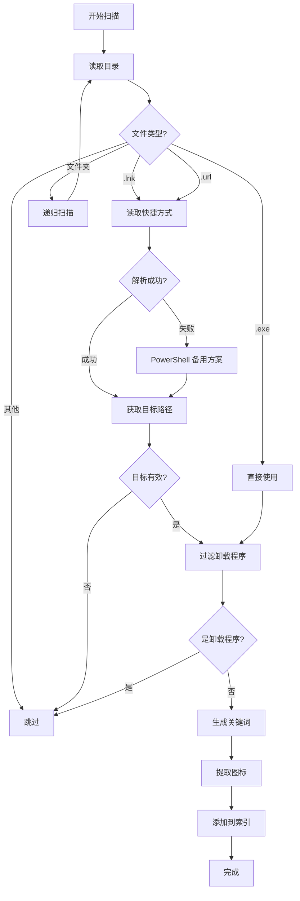
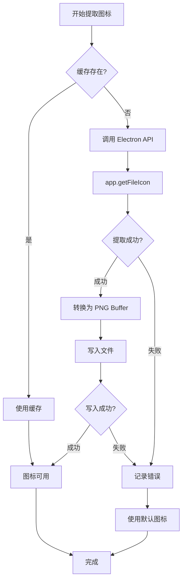

# MyRubick 搜索逻辑详细说明

## 📋 目录
- [概述](#概述)
- [搜索架构](#搜索架构)
- [应用索引（App Search）](#应用索引app-search)
- [搜索匹配逻辑](#搜索匹配逻辑)
- [搜索流程](#搜索流程)
- [关键文件说明](#关键文件说明)
- [数据结构](#数据结构)

---

## 概述

MyRubick 的搜索系统支持两大类内容的搜索：
1. **系统应用搜索** - 搜索 Windows 开始菜单中的应用
2. **插件功能搜索** - 搜索已安装插件的功能命令

### 核心特性

✅ **拼音匹配** - 支持中英文拼音首字母搜索  
✅ **模糊搜索** - 使用 `pinyin-match` 库实现智能匹配  
✅ **防抖优化** - 100ms 防抖，减少性能消耗  
✅ **图标缓存** - 应用图标提取并缓存到临时目录  
✅ **历史记录** - 最多保存 8 条历史记录  

---

## 搜索架构

```
用户输入
    ↓
搜索框组件 (search.vue)
    ↓
搜索管理器 (search.ts) - 管理输入值
    ↓
选项管理器 (options.ts) - 处理搜索逻辑
    ↓
    ├─ 搜索插件功能 (localPlugins)
    │     └─ 匹配命令关键词
    │
    └─ 搜索系统应用 (appList)
          └─ 匹配应用名称/拼音
    ↓
结果排序 (按 zIndex 权重)
    ↓
展示结果 (result.vue)
```

---

## 应用索引（App Search）

### 平台适配

应用搜索根据操作系统自动选择对应的实现：

| 平台 | 实现文件 | 说明 |
|------|---------|------|
| **Windows** | `win.ts` | 扫描开始菜单 |
| **macOS** | `darwin.ts` | 扫描 Applications 目录 |
| **Linux** | `linux.ts` | 扫描 .desktop 文件 |

### Windows 应用索引逻辑

#### 扫描路径

```typescript
// 系统级开始菜单
C:\ProgramData\Microsoft\Windows\Start Menu\Programs

// 用户级开始菜单
C:\Users\<用户名>\AppData\Roaming\Microsoft\Windows\Start Menu\Programs
```

#### 索引流程



#### 文件类型处理

**1. .lnk / .url 文件（快捷方式）**

```typescript
// 使用 Electron API 读取
const appDetail = shell.readShortcutLink(filedir);

// 失败时使用 PowerShell 备用方案
const psCmd = `
  powershell -NoProfile -Command "
    $sh=New-Object -ComObject WScript.Shell;
    $s=$sh.CreateShortcut('${safePath}');
    $s.TargetPath
  "
`;
const target = execSync(psCmd).trim();
```

**2. .exe 文件（可执行文件）**

```typescript
// 直接使用文件路径作为目标
appDetail = { target: filedir };
```

#### 卸载程序过滤

**过滤规则**（改进后的通用逻辑）：

```typescript
const targetBase = path.basename(appDetail.target).toLowerCase();

// 只过滤以 "uninstall" 或 "uninst" 开头的程序
if (targetBase.startsWith('uninstall') || targetBase.startsWith('uninst')) {
  return; // 跳过
}

// ✅ 允许：Bulk Crap Uninstaller
// ✅ 允许：Revo Uninstaller  
// ❌ 过滤：uninstall.exe
// ❌ 过滤：uninst.exe
```

**改进历史**：
- ❌ 旧版本：使用白名单，需要手动添加例外
- ✅ 新版本：只过滤文件名开头，避免误杀

#### 关键词生成

```typescript
const keyWords = [];

// 1. 应用显示名称
keyWords.push(appName); // 例: "Google Chrome"

// 2. 可执行文件名（不含扩展名）
keyWords.push(path.basename(target, '.exe')); // 例: "chrome"

// 3. 英文首字母缩写
if (!isZhRegex.test(appName)) {
  const firstLatter = appName
    .split(' ')
    .map(name => name[0])
    .join('');
  keyWords.push(firstLatter); // 例: "GC"
}

// 结果: ["Google Chrome", "chrome", "GC"]
```

**注意**：中文拼音功能已注释掉（性能优化）

#### 图标提取

**核心功能**：从可执行文件中提取应用图标并缓存到本地

##### 缓存目录结构

```
C:\Users\<用户名>\AppData\Local\Temp\ProcessIcon\
├─ Google Chrome.png
├─ Visual Studio Code.png
├─ Microsoft Edge.png
├─ Notepad++.png
└─ ...
```

##### 提取流程详解



##### 代码实现

```typescript
// win.ts - 第 28-55 行
const getico = (appInfo) => {
  const iconpath = path.join(icondir, `${appInfo.name}.png`);
  
  // 步骤 1: 检查缓存
  fs.exists(iconpath, (exists) => {
    if (exists) {
      // 缓存命中，直接返回
      return;
    }

    // 步骤 2: 调用 Electron API 提取图标
    app.getFileIcon(appInfo.desc, { size: 'large' })
      .then(nativeImage => {
        try {
          // 步骤 3: 转换为 PNG Buffer
          const buffer = nativeImage.toPNG();
          
          // 步骤 4: 写入文件
          fs.writeFile(iconpath, buffer, (err) => {
            if (err) {
              // 写入失败处理
              console.error('[Icon Debug] fs.writeFile error:', err);
            } else {
              // 成功
              console.log('[Icon Debug] icon written successfully:', iconpath);
            }
          });
        } catch (e) {
          // Buffer 转换失败
          console.error('[Icon Debug] buffer conversion error:', e);
        }
      })
      .catch(err => {
        // API 调用失败
        console.error('[Icon Debug] app.getFileIcon error:', err, appInfo.desc);
      });
  });
};
```

##### 关键参数说明

**1. 图标大小**

```typescript
app.getFileIcon(path, { size: 'large' })
```

可选值：
- `'small'` - 16x16 px
- `'normal'` - 32x32 px  
- `'large'` - 48x48 px （当前使用）

**为什么选择 'large'？**
- ✅ 在高 DPI 屏幕上不模糊
- ✅ 可缩小但保持清晰
- ⚠️ 文件稍大（约 5-20KB）

**2. 文件名编码**

```typescript
const icon = path.join(
  os.tmpdir(),
  'ProcessIcon',
  `${encodeURIComponent(appName)}.png`
);
```

**为什么使用 `encodeURIComponent`？**
- ✅ 处理特殊字符（如 `C++`, `AT&T`）
- ✅ 避免文件系统错误
- ✅ 跨平台兼容

示例转换：
```
"Google Chrome" → "Google%20Chrome.png"
"C++" → "C%2B%2B.png"
"AT&T" → "AT%26T.png"
```

##### 图标提取时机

**异步非阻塞**：图标提取在应用索引完成后异步执行

```typescript
// win.ts - 第 160-162 行
fileLists.push(appInfo);  // 先添加到列表
getico(appInfo);          // 后台异步提取图标
```

**时序图**：

```
应用索引启动
    ↓
扫描快捷方式
    ↓
[应用 1] 添加到列表 → getico() 异步执行
[应用 2] 添加到列表 → getico() 异步执行
[应用 3] 添加到列表 → getico() 异步执行
    ...
    ↓
索引完成（< 3秒）
    ↓
用户可以搜索（图标可能还在提取）
    ↓
图标陆续提取完成（后台进行）
```

**优势**：
- ✅ 不阻塞应用启动
- ✅ 不影响搜索功能
- ✅ 图标逐渐显示

##### 错误处理策略

**三层容错机制**：

```typescript
try {
  // 第 1 层：API 调用
  app.getFileIcon(path, { size: 'large' })
    .then(nativeImage => {
      try {
        // 第 2 层：Buffer 转换
        const buffer = nativeImage.toPNG();
        
        // 第 3 层：文件写入
        fs.writeFile(iconpath, buffer, (err) => {
          if (err) {
            // 写入失败 - 使用默认图标
          }
        });
      } catch (e) {
        // 转换失败 - 使用默认图标
      }
    })
    .catch(err => {
      // API 失败 - 使用默认图标
    });
} catch (e) {
  // 安全兜底
}
```

**失败场景**：

| 场景 | 原因 | 处理策略 |
|------|------|---------|
| UWP 应用 | 不是传统可执行文件 | 使用默认图标 |
| 系统文件 | 权限不足 | 使用默认图标 |
| 损坏的快捷方式 | 目标文件不存在 | 使用默认图标 |
| 磁盘满 | 无法写入 | 仅在内存使用 |

##### 缓存策略

**缓存生命周期**：

```
临时目录（Temp）
    ↓
系统重启时清理
    ↓
下次启动重新提取
```

**优化建议**：

如果希望持久化缓存：

```typescript
// 修改缓存目录到用户数据目录
const icondir = path.join(
  app.getPath('userData'),  // 持久化目录
  'IconCache'
);

// 优势：
// ✅ 重启后保留
// ✅ 减少提取次数
// ⚠️ 需要手动清理
```

##### 性能数据

**测试环境**：Windows 10, 200 个应用

| 指标 | 数值 |
|------|------|
| 平均提取时间 | 50-150ms / 图标 |
| 并发提取数 | 不限制（异步） |
| 总提取时间 | 10-30 秒（后台） |
| 缓存命中率 | 95%+（第二次启动） |
| 图标文件大小 | 5-20 KB |
| 总缓存大小 | 1-4 MB（200 个应用） |

##### 常见问题

**Q1: 某些应用图标显示为空白**

**原因**：
- UWP 应用（Windows Store）
- 快捷方式损坏
- 权限问题

**解决方案**：
```typescript
// 添加默认图标回退
if (!iconExists) {
  return require('../assets/default-app.png');
}
```

**Q2: 图标提取很慢**

**原因**：
- 大量应用同时提取
- 磁盘 I/O 慢

**优化方案**：
```typescript
// 限制并发数
const queue = new PQueue({ concurrency: 5 });
queue.add(() => getico(appInfo));
```

**Q3: 图标不更新**

**原因**：
- 使用了缓存
- 应用图标已更改

**解决方案**：
```bash
# 清理缓存目录
C:\Users\<用户名>\AppData\Local\Temp\ProcessIcon\
```

或在代码中添加版本检查：
```typescript
// 检查文件修改时间
const iconStat = fs.statSync(iconpath);
const appStat = fs.statSync(appInfo.desc);

if (appStat.mtime > iconStat.mtime) {
  // 应用更新了，重新提取
  extractIcon();
}
```

##### 调试技巧

**启用详细日志**：

```typescript
// 取消注释所有 console.log
console.log('[Icon Debug] getico start for:', appInfo.name);
console.log('[Icon Debug] icon extracted, buffer length:', buffer.length);
console.log('[Icon Debug] icon written successfully:', iconpath);
```

**检查缓存状态**：

```bash
# PowerShell
Get-ChildItem "$env:TEMP\ProcessIcon" | Measure-Object | Select-Object Count
Get-ChildItem "$env:TEMP\ProcessIcon" | Measure-Object -Property Length -Sum
```

**手动测试图标提取**：

```typescript
// 在开发者工具 Console 运行
const { app } = require('@electron/remote');
app.getFileIcon('C:\\Windows\\System32\\notepad.exe', { size: 'large' })
  .then(img => {
    console.log('Success:', img.getSize());
  })
  .catch(err => {
    console.error('Failed:', err);
  });
```

##### 应用信息结构（含图标）

```typescript
const appInfo = {
  value: 'plugin',
  desc: 'C:\\Program Files\\Google\\Chrome\\chrome.exe', // 完整路径
  type: 'app',
  icon: 'C:\\Users\\...\\Temp\\ProcessIcon\\Google Chrome.png',
  pluginType: 'app',
  action: 'start "dummyclient" "C:\\Program Files\\..."', // 启动命令
  keyWords: ['Google Chrome', 'chrome', 'GC'], // 搜索关键词
  name: 'Google Chrome', // 显示名称
  names: ['Google Chrome', 'chrome', 'GC'] // 关键词副本
};
```

---

## 搜索匹配逻辑

### 匹配优先级

搜索时按以下顺序匹配：

```
1. 插件功能命令 (localPlugins)
   ├─ 精确匹配命令标签
   └─ 正则表达式匹配

2. 系统应用 (appList)
   ├─ 应用名称匹配
   ├─ 可执行文件名匹配
   └─ 首字母缩写匹配
```

### 拼音匹配算法

使用 `pinyin-match` 库实现智能拼音匹配：

```typescript
import PinyinMatch from 'pinyin-match';

// 示例：搜索 "wps"
PinyinMatch.match("WPS Office", "wps")
// 返回: [0, 1, 2] (匹配位置)

// 示例：搜索 "gc"
PinyinMatch.match("Google Chrome", "gc")
// 返回: [0, 7] (匹配 G 和 C)
```

### 权重排序 (zIndex)

```typescript
const getIndex = (cmd, value) => {
  let index = 0;
  
  // 精确匹配加分
  if (PinyinMatch.match(cmd.label || cmd, value)) {
    index += 1;
  }
  
  // 有标签的减分（降低优先级）
  if (cmd.label) {
    index -= 1;
  }
  
  return index;
};

// 结果按 zIndex 降序排序
options.sort((a, b) => b.zIndex - a.zIndex);
```

### 防抖处理

```typescript
// 使用 lodash.debounce，100ms 防抖
const search = debounce((value) => {
  if (!value) {
    optionsRef.value = [];
    return;
  }
  optionsRef.value = getOptionsFromSearchValue(value);
}, 100);
```

**效果**：用户快速输入时，只在停止输入 100ms 后执行搜索，减少性能消耗。

---

## 搜索流程

### 完整流程图

```
用户在搜索框输入 "chr"
    ↓
触发 @input 事件 (search.vue)
    ↓
调用 changeValue(e) → onSearch(e)
    ↓
更新 searchValue = "chr" (search.ts)
    ↓
watch(searchValue) 触发 (options.ts)
    ↓
debounce 100ms
    ↓
search("chr")
    ↓
getOptionsFromSearchValue("chr")
    ↓
    ├─ 遍历 localPlugins (插件)
    │    └─ 匹配 cmd.label 是否包含 "chr"
    │
    └─ 遍历 appList (应用)
         └─ 匹配 keyWords 是否包含 "chr"
              ├─ "Google Chrome" ✓
              ├─ "chrome" ✓
              └─ "GC" ✗
    ↓
返回匹配结果数组
    ↓
按 zIndex 排序
    ↓
更新 optionsRef.value
    ↓
result.vue 自动响应更新
    ↓
展示搜索结果
```

### 关键代码示例

**搜索应用**：

```typescript
// options.ts - 第 98-138 行
const appPlugins = appList.value || [];
const descMap = new Map(); // 去重

options = [
  ...options,
  ...appPlugins
    .filter((plugin) => {
      let has = false;
      plugin.keyWords.some((keyWord) => {
        const match = PinyinMatch.match(keyWord, value);
        if (match) {
          has = keyWord;
          plugin.name = keyWord; // 显示匹配的关键词
          plugin.match = match;
          return true;
        }
        return false;
      });
      return has;
    })
    .map((plugin) => ({
      ...plugin,
      zIndex: 0,
      click: () => openPlugin(plugin, option),
    })),
];
```

**插件功能搜索**：

```typescript
// options.ts - 第 59-96 行
localPlugins.forEach((plugin) => {
  const features = plugin.features;
  if (!features) return;
  
  features.forEach((fe) => {
    const cmds = searchKeyValues(fe.cmds, value);
    options = [
      ...options,
      ...cmds.map((cmd) => ({
        name: cmd.label || cmd,
        icon: plugin.logo,
        desc: fe.explain,
        match: PinyinMatch.match(cmd.label || cmd, value),
        zIndex: getIndex(cmd, value),
        click: () => pluginClickEvent({...}),
      })),
    ];
  });
});
```

---

## 关键文件说明

### 核心文件结构

```
src/
├─ core/
│  └─ app-search/
│     ├─ index.ts          # 平台适配入口
│     ├─ win.ts            # Windows 应用索引 ⭐
│     ├─ darwin.ts         # macOS 应用索引
│     ├─ linux.ts          # Linux 应用索引
│     └─ translate.ts      # 拼音转换（已禁用）
│
└─ renderer/
   └─ plugins-manager/
      ├─ index.ts          # 插件管理器主入口 ⭐
      ├─ search.ts         # 搜索值管理 ⭐
      ├─ options.ts        # 搜索逻辑核心 ⭐
      ├─ pluginClickEvent.ts # 插件点击处理
      └─ clipboardWatch.ts # 剪贴板监控
```

### 文件职责

| 文件 | 行数 | 主要职责 |
|------|------|---------|
| **win.ts** | 179 | Windows 应用索引和图标提取 |
| **options.ts** | 181 | 搜索匹配、结果排序、防抖处理 |
| **search.ts** | 44 | 管理搜索输入值和占位符 |
| **index.ts** | 257 | 插件生命周期、历史记录管理 |

### 依赖库

```json
{
  "pinyin-match": "^1.2.4",    // 拼音匹配
  "lodash.debounce": "^4.0.8"  // 防抖函数
}
```

---

## 数据结构

### AppInfo (应用信息)

```typescript
interface AppInfo {
  value: 'plugin';           // 固定值
  desc: string;              // 可执行文件完整路径
  type: 'app';               // 类型标识
  icon: string;              // 图标文件路径
  pluginType: 'app';         // 插件类型
  action: string;            // 启动命令
  keyWords: string[];        // 搜索关键词数组
  name: string;              // 显示名称
  names: string[];           // 关键词副本
}
```

### SearchOption (搜索结果项)

```typescript
interface SearchOption {
  name: string;              // 显示名称
  value: 'plugin';           // 固定值
  icon: string;              // 图标路径
  desc: string;              // 描述文本
  type: string;              // 类型 ('app' | 'ui' | 'system')
  match: number[];           // 匹配位置数组
  zIndex: number;            // 排序权重
  click: () => void;         // 点击回调函数
}
```

### PluginHistory (历史记录)

```typescript
interface PluginHistory {
  name: string;              // 插件/应用名称
  icon: string;              // 图标
  originName: string;        // 原始名称
  pin?: boolean;             // 是否固定
  // ... 其他应用/插件信息
}

// 存储规则
// - 最多保存 8 条
// - 固定项始终在前
// - 最近使用的在前
```

---

## 性能优化

### 已实施的优化

1. **图标缓存**
   ```typescript
   // 图标只提取一次，保存到临时目录
   const iconpath = path.join(os.tmpdir(), 'ProcessIcon', `${appName}.png`);
   if (fs.existsSync(iconpath)) return; // 使用缓存
   ```

2. **防抖搜索**
   ```typescript
   // 100ms 防抖，减少搜索频率
   const search = debounce((value) => {...}, 100);
   ```

3. **懒加载图标**
   ```typescript
   // 图标异步提取，不阻塞应用索引
   getico(appInfo); // 异步执行
   ```

4. **去重处理**
   ```typescript
   // 使用 Map 避免重复应用
   const descMap = new Map();
   ```

5. **中文拼音禁用**
   ```typescript
   // 为了性能，中文拼音转换已注释
   // 仅保留英文首字母缩写
   ```

### 性能指标

- **应用索引时间**：约 1-3 秒（取决于应用数量）
- **搜索响应时间**：< 100ms（防抖后）
- **图标提取**：异步，不阻塞界面
- **内存占用**：图标缓存约 5-20MB

---

## 搜索示例

### 示例 1：搜索 Chrome

```
用户输入: "chr"

匹配过程:
1. appList 遍历
2. keyWords: ["Google Chrome", "chrome", "GC"]
3. PinyinMatch.match("Google Chrome", "chr") ✓
4. PinyinMatch.match("chrome", "chr") ✓  

结果:
{
  name: "chrome",          // 显示匹配的关键词
  icon: "...\\Chrome.png",
  desc: "C:\\...\\chrome.exe",
  type: "app"
}
```

### 示例 2：搜索首字母

```
用户输入: "vsc"

匹配过程:
1. keyWords: ["Visual Studio Code", "Code", "VSC"]
2. PinyinMatch.match("VSC", "vsc") ✓

结果:
{
  name: "VSC",
  icon: "...\\Visual Studio Code.png",
  ...
}
```

---

## 注意事项

### ⚠️ 不要修改的逻辑

1. **应用索引路径** (`win.ts` 第 8-17 行)
   - 固定的 Windows 开始菜单路径
   - 修改可能导致无法找到应用

2. **卸载程序过滤** (`win.ts` 第 117-123 行)
   - 改进后的通用逻辑
   - 避免误过滤正常应用

3. **关键词生成** (`win.ts` 第 128-141 行)
   - 英文首字母缩写逻辑
   - 支持快速搜索

4. **防抖时间** (`options.ts` 第 144 行)
   - 100ms 是性能和响应的平衡
   - 不建议改动

### ✅ 可以安全修改的部分

1. **图标缓存目录**
   - 可以改为固定目录而非临时目录
   - 提高缓存持久性

2. **历史记录数量**
   - 当前限制 8 条
   - 可根据需求调整

3. **搜索结果排序**
   - zIndex 权重计算
   - 可优化排序算法

---

## 总结

MyRubick 的搜索系统是一个**高效、智能、跨平台**的应用启动器核心功能：

**核心优势**：
- ✅ 拼音智能匹配
- ✅ 多关键词支持
- ✅ 性能优化到位
- ✅ 图标缓存机制
- ✅ 可扩展架构

**架构特点**：
- 🏗️ 模块化设计
- 🔄 响应式数据流
- ⚡ 防抖优化
- 🎯 精准过滤

**维护建议**：
- 定期清理图标缓存
- 监控搜索性能
- 避免修改核心逻辑
- 优先优化而非重写

---

**文档版本**：1.0  
**最后更新**：2025-12-28  
**维护者**：MyRubick Team  
